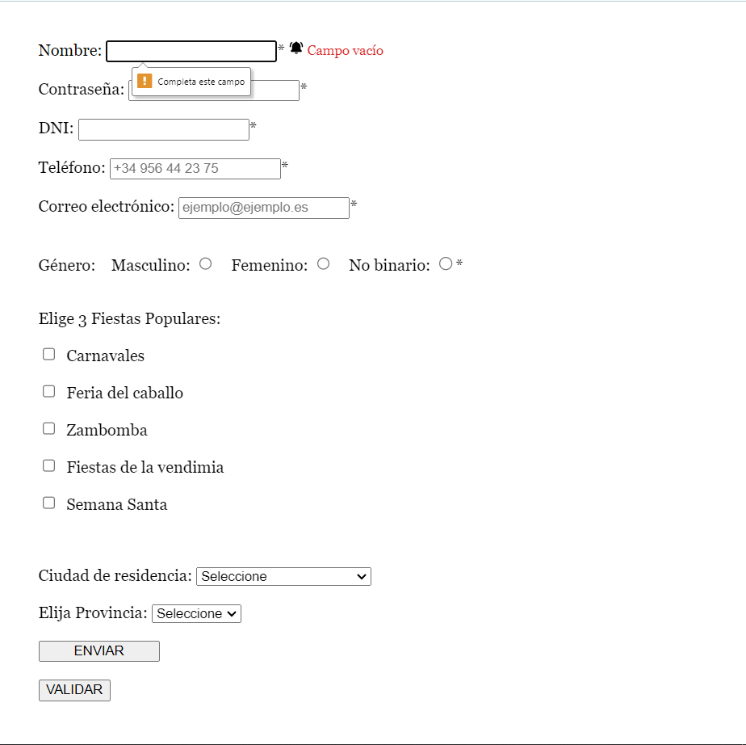

# Formulario con JavaScript 

Ejercicio en clase para practicar a validar formularios con JavaScript y HTML5.

## Captura de Pantalla

## Ver ejemplo en vivo
[[(https://github.com/iSaan86/formularioJS)](https://github.com/iSaan86/formularioJS)]

## Tecnologías Utilizadas

- HTML5
- CSS3
- JavaScript

## Contacto

Para cualquier pregunta o comentario, no dudes en contactarme:

- Nombre: Alexandra Ferrera Arenas
- Perfil de Linkedin: https://www.linkedin.com/in/alexandra-ferrera-arenas/
- Correo Electrónico: sandraferreraarenas@gmail.com
